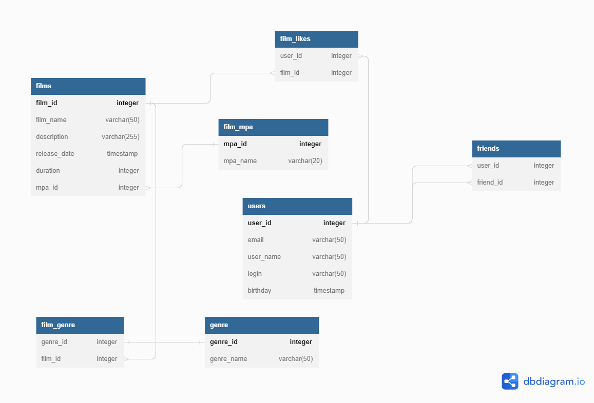

# java-filmorate

Сервис, работающий с фильмами и пользователями. Можно просмотреть информацию о фильмах, оставить свой лайк, 
увидеть топ-фильмов, выбранных пользователями, а также добавить другого пользователя в друзья.

Схема базы данных

Примеры запросов к базе данных:

*Получить фильм по id:* select f.film_id, f.film_name, f.description, f.release_date, " +
"f.duration, f.mpa_id, m.mpa_name from films f left join film_mpa m on f.mpa_id=m.mpa_id " +
"where film_id = ?

*Добавить пользователя в друзья:* insert into friends (user_id, friend_id) values (?, ?)

*Получить список всех жанров:* select * from genre

*Получить рейтинг по id:* select * from film_mpa where mpa_id = ?
